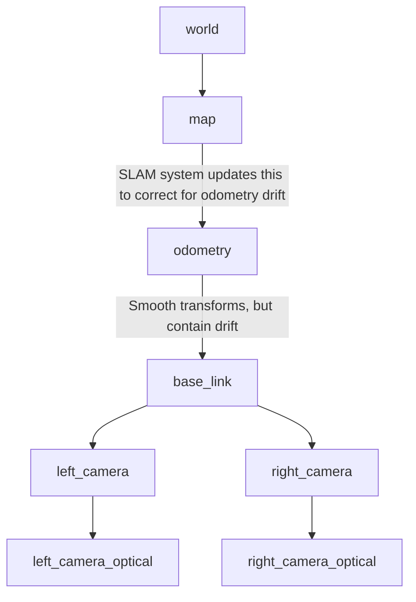

tags: #ROS #robotics 
related: [[Robot Coordinate Systems]]

---

The purpose of these frames is outlined below:

| Frame      | Description                                                                  |
| ---------- | ---------------------------------------------------------------------------- |
| `map`      | the jumps from `map` to `odometry` are not expected to be smooth             |
| `odometry` | The motion of the `base_link` frame should be smooth relative to this frame. |

Useful ROS Documents:
- [REP 103](https://www.ros.org/reps/rep-0103.html) - Standard Units of Measure and Coordinate Systems
- [REP 105](https://ros.org/reps/rep-0105.html) - Coordinate Frame for Mobile Robots
